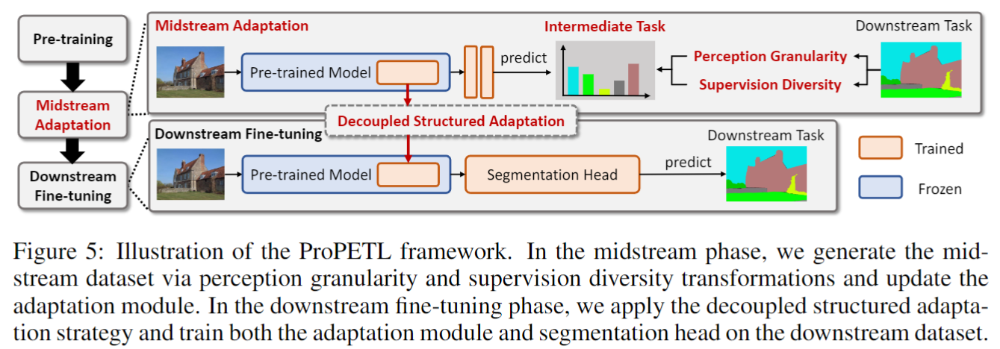

# ProPETL
Official PyTorch implementation of Progressive Parameter Efficient Transfer Learning for Semantic Segmentation (ICLR 2025).




## Environments

* Python: 3.8.17
* PyTorch: 1.10.1+cu111
* TorchVision: 0.11.2+cu111
* MMEngine: 0.10.4
* MMSegmentation: 1.1.0
* GPU: 2* NVIDIA A800 80GB


## Usage


### Dataset preparation

The datasets used in Table 1 can be downloaded via their official link or follow the data instructions in MMSegmentation.

### Pretrained model preparation

The pretrained model checkpoints used in the paper can be found in the table below. 

Please put the checkpoint in ```  ./pretrain```.

| Backbone architecture | Pretraining strategy        |                             Url                              |
| --------------------- | --------------------------- | :----------------------------------------------------------: |
| Swin-Large            | IN-22k image classification | [Checkpoint](https://drive.google.com/file/d/1-PMLoi4cQfE19h7paAHqjYLcj4vNjIq0/view?usp=drive_link) |
| # TODO                |                             |                                                              |


## Training

Fine-tuning Swin-Large+UperNet on VOC2012. 

```bash
# midstream adaptation
bash ./tools/dist_train_port.sh ./configs/swin_mid_train/swin_l_1xb16_20k_voc-640x640_adaptformer_r24_global_cls.py 1 39990
# downstream fine-tuning
bash ./tools/dist_train_port.sh ./configs/upernet/upernet_swin_l_2xb8_40k_voc-640x640_adaptformer_r24_two_concat_G_cls_lr4.py 2 39990
```

Fine-tuning Swin-Large+UperNet on ADE20k. 

```bash
# midstream adaptation
bash ./tools/dist_train_port.sh ./configs/swin_mid_train/swin_l_2xb8_80k_ade-640x640_adaptformer_r24_global_cls.py 2 39990
# downstream fine-tuning
bash ./tools/dist_train_port.sh ./configs/upernet/upernet_swin_l_2xb8_160k_ade20k-640x640_adaptformer_r24_two_concat_G_cls_lr3e4_wd2e2.py 2 39990
```

Fine-tuning Swin-Large+UperNet on COCO-Stuff10k.

```bash
# midstream adaptation
bash ./tools/dist_train_port.sh ./configs/swin_mid_train/swin_l_1xb16_40k_coco-640x640_adaptformer_r48_global_cls.py 1 39990
# downstream fine-tuning
bash ./tools/dist_train_port.sh ./configs/upernet/upernet_swin_l_2xb8_80k_coco-640x640_adaptformer_r48_two_concat_G_cls_densetest.py 2 39990
```

Fine-tuning Swin-Large+UperNet on CityScapes.  

```bash
# TODO
```


## Citation

If you find this repository useful, please kindly consider citing the following paper:

```
@article{zhou2025propetl,
  title={Progressive Parameter Efficient Transfer Learning for Semantic Segmentation},
  author={Zhou, Nan and Wang, Huiqun and Zheng, Yaoyan and Huang, Di},
  booktitle={ICLR},
  year={2025}
}
```